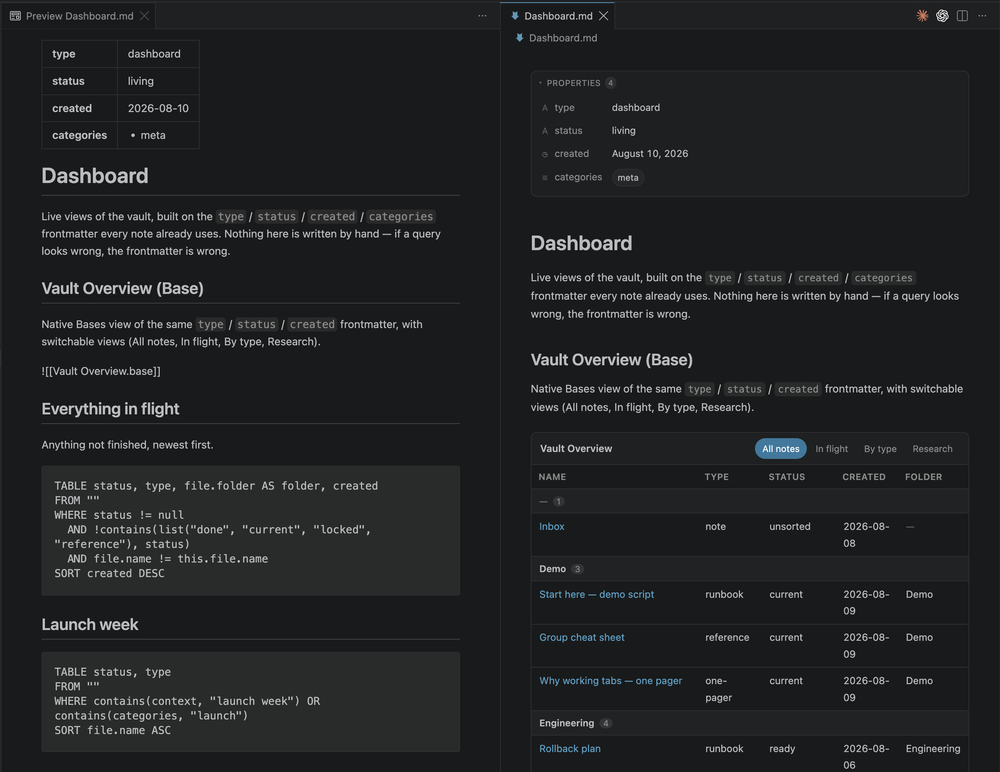
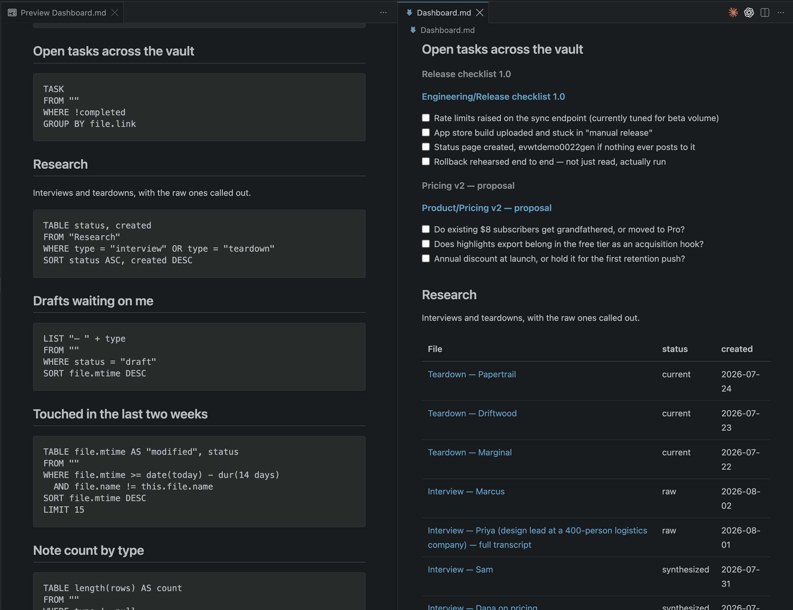

# Obsidian Preview

Interactive preview for Obsidian vaults in VS Code. Runs **DataviewJS**, **DQL**, and
**Obsidian Bases**, resolves wikilinks, and writes task toggles back to the source file.

<p align="center">
  
  
</p>
<p align="center"><sub>Left: raw markdown source. Right: Obsidian Preview — properties panel, an embedded Base, editable task checkboxes, and live DQL results.</sub></p>

## Why a custom editor

VS Code's built-in markdown preview cannot host DataviewJS, for two independent reasons:

1. **CSP.** Its webview has no `unsafe-eval`, so `new AsyncFunction(...)` is unavailable.
2. **Sync rendering.** `extendMarkdownIt` fence rules are synchronous, and DataviewJS blocks
   are async by nature (`await dv.view(...)`).

This extension registers a `CustomTextEditorProvider` instead. That gives it its own CSP,
async rendering, a private RPC channel to the extension host — and, because it works off the
`TextDocument`, undo/redo, dirty state, and saving all flow through VS Code's normal pipeline
rather than being reimplemented.

Open any note with **Obsidian Preview: Open Preview to the Side**, or right-click →
*Reopen Editor With…*. The plain text editor keeps working untouched.

## What works

**Rendering** — wikilinks (`[[Note]]`, `[[Note|alias]]`, `[[Note#Heading]]`), embeds, tags,
`==highlights==`, and markdown inside table cells.

**Frontmatter** renders as a collapsible properties panel rather than as two horizontal rules
around a paragraph of raw YAML. Values are typed: dates are formatted, booleans and numbers get
their own treatment, lists become chips, `tags` become clickable tag chips, wikilinks and URLs
become links, and malformed YAML surfaces an error panel with the raw block instead of silently
vanishing. The frontmatter lines are blanked rather than removed, so body line numbers still
match the source file — which is what keeps task toggling accurate.

**Interaction** — clicking a checkbox edits the source note through a `WorkspaceEdit`, so it is
undoable and marks the buffer dirty exactly like typing. Clicking a wikilink opens the target
(⌘/Ctrl-click for a new tab); an unresolved link offers to create the note.

**DQL** — `TABLE` / `TABLE WITHOUT ID` / `LIST` / `TASK`, `FROM` (folders, tags, links,
`outgoing()`, with `and` / `or` / negation), `WHERE`, `SORT`, `GROUP BY`, `FLATTEN`, `LIMIT`,
`AS`. Expressions are parsed by a real tokenizer and Pratt parser, so keywords inside string
literals (`WHERE title = "From Russia"`) and wikilinks are safe. ~55 functions including
`contains`, `length`, `list`, `date`, `dur`, `dateformat`, `choice`, `default`, `filter`, `map`.

After `GROUP BY`, `rows` is bound and later clauses operate on the groups — so
`GROUP BY type SORT length(rows) DESC` orders the groups by size, and a grouped `TABLE`
collapses into one table whose first column is the group key. Task rows inherit their page's
fields (`file.link`, frontmatter), with the task's own implicit fields taking precedence.
Duration literals (`dur(14 days)`) and date keywords (`date(today)`, `sow`, `eom`) work.

**Obsidian Bases** — `![[Something.base]]` embeds and ` ```base ` blocks render as a tabbed
view switcher with **table**, **cards**, and **list** views, matching Obsidian's layout.
Supports base-level and per-view `filters` (`and` / `or` / `not`), `formulas`, `properties`
`displayName`, `groupBy`, `sort`, and `limit`.

Bases has its own expression language, separate from DQL — `==` / `&&` / `||`, method chaining
(`list("done").contains(status)`, `type.upper().startsWith("I")`), and a `file` namespace with
`inFolder()`, `hasTag()`, `hasLink()`, `hasProperty()`, `asLink()`. Globals include `if()`,
`date()`, `today()`, `now()`, `list()`, `link()`, `number()`, `min()`, `max()`, `round()`, and
duration arithmetic (`(today() - date(created)).days`). Editing a `.base` file re-renders any
preview embedding it.

A filter that fails to parse surfaces an error and is skipped, rather than silently matching
nothing and showing an empty view.

**Inline queries** — `` `= this.created` `` evaluates DQL against the current page;
`` `$= dv.pages().length` `` runs inline JavaScript in the same sandbox as a `dataviewjs`
block. No separate setting to enable, unlike Obsidian.

**DataviewJS** — `dv.container`, `view`, `el`, `header`, `paragraph`, `span`, `table`, `list`,
`taskList`, `pages`, `pagePaths`, `page`, `current`, `array`, `date`, `duration`, `query`,
`evaluate`, `luxon`, `func`. `DataArray` is Proxy-backed, so field auto-mapping
(`pages.file.name`), numeric indexing, and spreading all behave as they do in Obsidian.

**Obsidian compatibility** — `moment`, `DateTime` and `luxon` globals; the
`HTMLElement.prototype` helpers (`createEl`, `createDiv`, `empty`, `setText`, `addClass`, …);
and an `app` shim covering `vault.read/modify/create/delete/getAbstractFileByPath`,
`workspace.openLinkText/getActiveFile/activeLeaf`, `metadataCache.getFirstLinkpathDest/
getFileCache/resolvedLinks`, and `commands.executeCommandById`.

`dv.view("name", input)` loads `name/view.js` (or `name.js`) plus a sibling `view.css` from the
vault and executes it, the way Obsidian does.

## What does not work

- **Other plugins.** `app.plugins.plugins["some-plugin"]` returns undefined. Snippets that
  reach into Obsidian Charts, Full Calendar, Tasks, or Templater cannot work outside Obsidian.
- **Tasks from other files.** Checkboxes rendered by a query that pulls tasks from other notes
  are display-only; only tasks in the previewed note can be toggled.
- **Note embeds** render as a clickable placeholder rather than recursively inlining content.
- **Obsidian command ids** are mapped for a small set; the rest report as unsupported.

## Configuration

| Setting | Default | Meaning |
| --- | --- | --- |
| `obsidianPreview.vaultRoot` | `""` | Vault root relative to the workspace folder |
| `obsidianPreview.exclude` | `node_modules`, `.git`, `.obsidian`, `.trash` | Globs excluded from the index |
| `obsidianPreview.enableDataviewJs` | `true` | Execute `dataviewjs` blocks |
| `obsidianPreview.dailyNoteFormat` | `yyyy-MM-dd` | Luxon format used to derive `file.day` |

## Development

```bash
npm install
npm run dev          # esbuild watch
npm run typecheck
npm test             # 177 regression tests, no VS Code needed
```

Two harnesses run the engine headlessly against a real vault:

```bash
npm run test:vault -- /path/to/vault   # execute every dataview/dataviewjs block
npm run test:links -- /path/to/vault   # verify link resolution
```

`test:links` distinguishes genuinely dangling links from resolver bugs, so a high unresolved
count does not hide a broken resolver.

## Notes on correctness

A few behaviours are easy to get subtly wrong and are covered by tests:

- `file.name` excludes the extension (Obsidian's does).
- `FROM "notes"` matches on a path boundary — it must not match `my-notes-archive/`.
- Tags are not harvested from code fences, inline code, or URL fragments.
- `[[Foo]]` prefers a same-folder match before a vault-root one; ambiguous basenames fall back
  to shortest-path, then alphabetical.
- `file.day` is derived without round-tripping through `new Date().toISOString()`, which shifts
  date-only values across the UTC boundary.
- `FROM #alpha` also matches `#alpha/beta`; tag sources are hierarchical.
- `await someDataArray` resolves instead of hanging (the Proxy returns `undefined` for `then`).

## License

MIT
